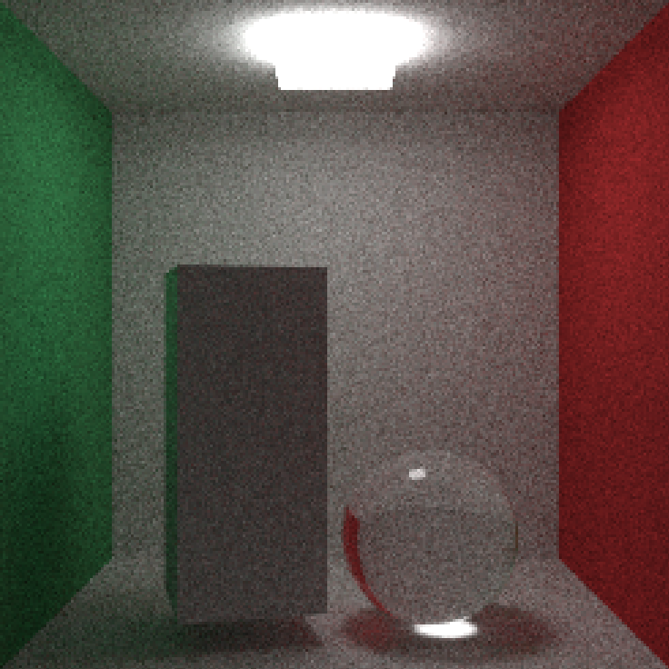

# 42cursus-miniRT
My first RayTracer with miniLibX

- image created with fewer samples (There is some noise)

- refraction with dielectric material

- final scene1

- final scene2 
## What we can do with this ray tracer
- object: sphere, plane, cylinder, cone, box
- material: lambertian, dielectric, metal
- texture: solid, checker, image(with xpm file)

You can create your own scene with this ray tracer.  
If you want, all you need to do is follow the .rt file rules.
